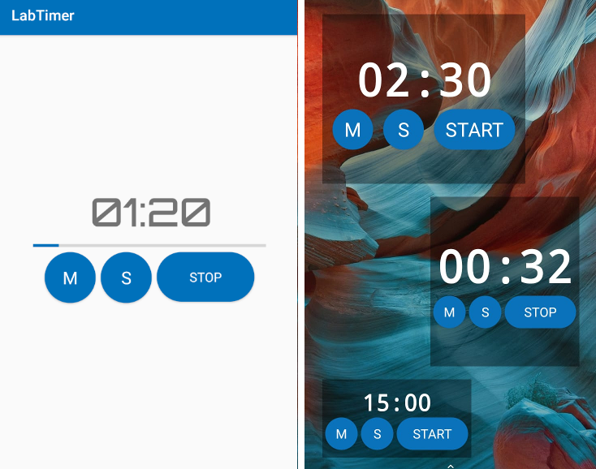

# LabTimer

A simple timer/stopwatch optimized for fast setup and immediate usage. Uses the three button interface of hardware lab timers.
appWidgets are available to control different timers directly on the home screen.

Usage:
to set a countdown timer use the minutes "M" and seconds "S" button, then start to run.
A prolonged press of "M" or "S" buttons increase the timer of 10 units (only in the app, not available in the widgets)
Pressing togheter "M" and "S" resets to zero

If the timer is started at 00:00, it acts as a stopwatch.